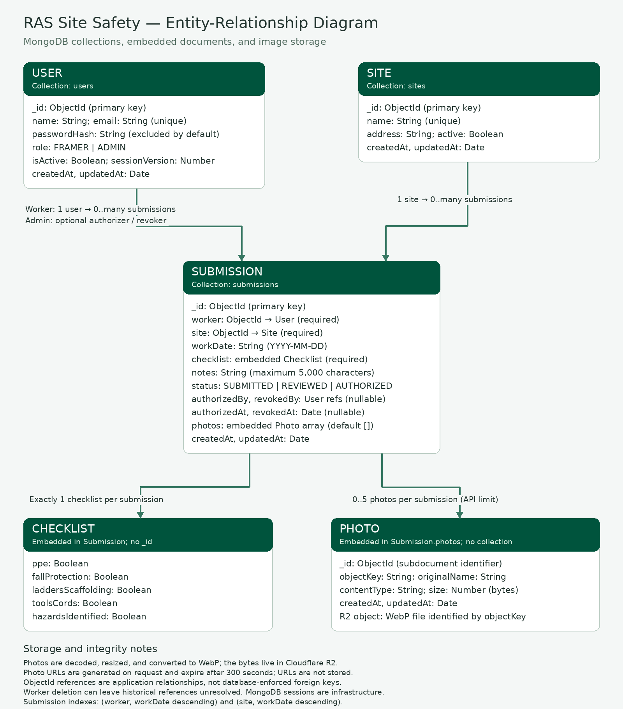

# RAS Site Safety Forms

A site safety application built for the Ron Anderson & Sons Junior Software Developer technical assessment.

Framers complete daily safety forms and attach photos. Administrators review submissions, authorize forms, and manage workers and job sites.

## Demo

- Deployed application: [Add deployed URL]
- GitHub repository: [Add repository URL]
- Entity-Relationship Diagram: [Add link to ERD image or PDF]

### Test credentials

Use dedicated demonstration accounts with fictional data.

| Role | Email | Password |
|---|---|---|
| Admin | admin@example.com | [Add demo password] |
| Framer | framer@example.com | [Add demo password] |

## Tech Stack

- Frontend: React, TypeScript, Vite, CSS
- Backend: Node.js, Express
- Database: MongoDB with Mongoose
- Authentication: express-session, connect-mongo, bcryptjs
- Photo storage: Cloudflare R2

## Features
## Entity-Relationship Diagram



### Framer workspace

- Sign in with individual credentials.
- Select a job site and work date.
- Complete a safety checklist and add notes.
- Submit safety forms and attach photos.
- View their own submissions and attached photos.

The worker identity is taken from the authenticated account rather than
accepted from the form.

### Admin workspace

- View submissions across workers and sites.
- Open submission details and review photos.
- Authorize forms or revoke authorization.
- Create worker accounts and set initial passwords.
- Change passwords or revoke worker access.
- Delete worker accounts.
- Add job sites with an optional address.

### User experience

- RAS branding and responsive layouts.
- An animated introductory splash shown once per browser tab.
- Session restoration after a page refresh.
- Loading states and success/error messages.

## Local Setup

### Prerequisites

- Node.js 22
- npm
- A MongoDB database
- A Cloudflare R2 bucket and credentials for photo uploads

### Backend

From the repository root:

```bash
cd server
npm install
```

Create `server/.env`:

```env
PORT=3000
NODE_ENV=development
CLIENT_ORIGIN=http://localhost:5173
MONGODB_URI=<your MongoDB connection string>
SESSION_SECRET=<a randomly generated secret of at least 64 characters>
```

Add the R2 environment variables required by the photo storage code.

[Before submission: list the exact R2 variable names and configuration
steps here. Provide placeholder values only.]

Start the API:

```bash
npm run dev
```

The API runs at `http://localhost:3000`.

### Frontend

Open a second terminal from the repository root:

```bash
cd client
npm install
```

Create `client/.env`:

```env
VITE_API_URL=http://localhost:3000/api
```

Start the frontend:

```bash
npm run dev
```

Open `http://localhost:5173`.

### Seed Data

The demonstration dataset must include a job site named **Kestrel Ridge**,
at least one Admin, and at least one Framer.

[Before submission: add the exact seed command and explain whether running
it updates or resets existing data.]

## Authentication and Access Control

Passwords are stored as bcrypt hashes. Password hashes are excluded from
normal User queries.

Authentication uses an HTTP-only session cookie. Sessions are stored in
MongoDB and have an eight-hour cookie lifetime.

Authorization is enforced on the backend:

- Framers can create submissions only for their own authenticated account.
- Framer submission queries are restricted to their own records.
- Admins can view all submissions and manage workers and sites.
- Password changes and access revocation increment a session version,
  invalidating older sessions on their next protected request.
- Deleted accounts can no longer authenticate or use protected routes.

## Data Model

The main application entities are users, sites, submissions, and photos.

- A user can have many submissions.
- A site can have many submissions.
- Each submission belongs to one worker and one site.
- Photos are associated with a submission.
- Submissions reference the administrator responsible for authorization
  or revocation.

[Before submission: attach the ERD and verify that its field names,
relationships, and photo-storage details match the actual models.]

## Crew Notes

### Assumptions and Decisions

- This is a demonstration application using fictional crew and site data.
- All authenticated workers can select any active job site.
- A checklist answer of “No” is valid and remains visible for admin review.
- Site addresses are optional.
- Saving a new worker password also restores their access.
- Worker account deletion retains submissions, but the current dashboard
  displays “Unavailable worker” when the user record no longer exists.
- The submissions endpoint returns the latest 100 records.
- AI tools assisted development. Submitted code must be reviewed and
  understood by the candidate.

### Remaining Assessment Work

- Add admin filters for site, worker, and date range.
- Add a simple submissions summary.
- Complete the ERD and link it above.
- Complete deployment and provide test credentials.
- Verify required-field and photo type/size validation.
- Verify the complete worker workflow on a phone.

Update this list as each item is completed.

## Manual Verification

Before submission, verify:

- Admin and Framer logins work.
- Refreshing restores the authenticated workspace.
- Framers cannot read another worker’s submission through the API.
- A worker can submit a form and upload photos.
- Stored photos remain viewable after refresh.
- Invalid form inputs and unsupported uploads show clear errors.
- Admins can review photos and authorize/revoke forms.
- Admins can add workers, change passwords, revoke access, and delete accounts.
- Revoked accounts and invalidated sessions cannot access protected routes.
- Newly added sites appear in the worker site selector after refresh.
- Duplicate worker emails and site names show clear errors.
- The deployed app supports the same workflows as the local app.

## Configuration

Do not commit `.env` files, database credentials, session secrets, or R2
credentials. Include `.env.example` files containing variable names and
placeholder values so the application can be configured by a reviewer.